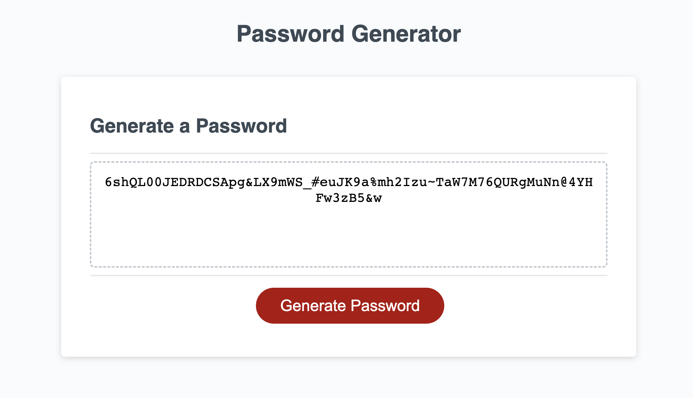

# password-project
This application allows you to generate a random password using numbers, symbols, upper and lower case letters.

### Usage:
To gnerate the password, click the button and enter an integer between 8-100 and follow the prompts
### Contributors:
na
### screenshot:

### Links
[github](https://github.com/mmontoya1112/password-project)
[deployed](https://mmontoya1112.github.io/password-project/)